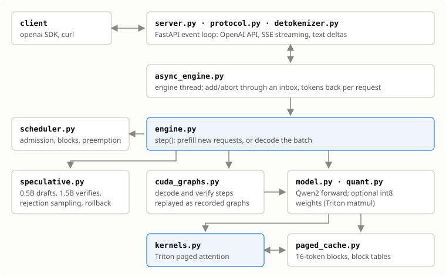
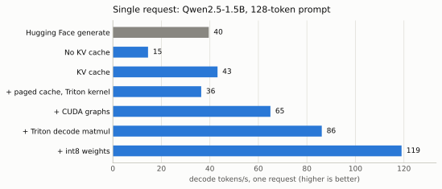
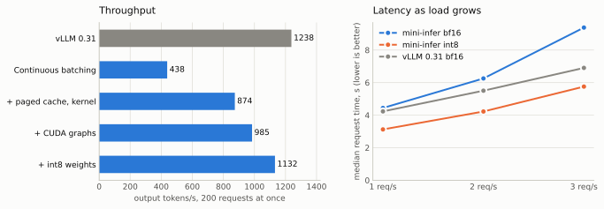
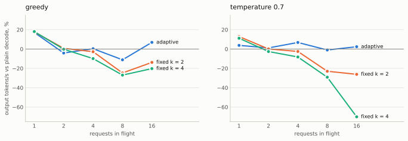
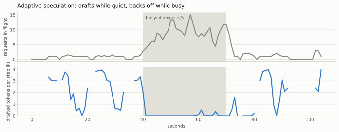

# mini-infer

A small LLM inference engine written from scratch in PyTorch and Triton. It serves Qwen2.5 models through an OpenAI-compatible API and implements the main serving optimizations one by one, with a benchmark after each.

Built to understand what inference servers like vLLM do, not to replace them.



## Results

RTX 5050 Laptop GPU (8 GB), Qwen2.5-1.5B-Instruct, bf16 unless noted. Raw numbers are in `bench/results/`; charts are generated from them with `python -m bench.charts`.

<picture>
  <source media="(prefers-color-scheme: dark)" srcset="docs/charts/single-request-dark.svg">
  
</picture>

<picture>
  <source media="(prefers-color-scheme: dark)" srcset="docs/charts/batching-dark.svg">
  
</picture>

Speculative decoding helps a quiet server and hurts a busy one, so the number of drafted tokens is chosen each step from measured acceptance and step times. A fixed setting is wrong somewhere; the adaptive policy stays within about 10% of the best policy at every load.

<picture>
  <source media="(prefers-color-scheme: dark)" srcset="docs/charts/speculation-policies-dark.svg">
  
</picture>

<picture>
  <source media="(prefers-color-scheme: dark)" srcset="docs/charts/adaptive-trace-dark.svg">
  
</picture>

int8 weights cost almost nothing in quality:

| | bf16 | int8 |
|---|---|---|
| WikiText-2 perplexity | 10.81 | 10.84 |
| Greedy tokens matching bf16 | | 98% |
| Weight memory | 3.09 GB | 2.02 GB |

## What's implemented

| Technique | What it fixes |
|---|---|
| KV cache | Stops recomputing past tokens every step |
| Continuous batching | GPU sits idle when decoding one request at a time |
| Paged KV cache | Fixed per-request memory slots waste most of the cache |
| Triton paged-attention kernel | Reading scattered cache blocks by copying them cost half of each step |
| CUDA graphs | Launching hundreds of small kernels from Python dominated each step |
| OpenAI-compatible server | Works with existing clients, streams tokens, frees memory on disconnect |
| Speculative decoding | Every token costs a full read of the weights; a small model drafts and the big one checks several per read |
| Adaptive speculation | The best number of drafts depends on load; a cost model picks it every step |
| int8 weights | Decode is limited by reading the weights; half the bytes per weight, with a Triton kernel that converts in registers |

## Run

Linux or WSL2 with an NVIDIA GPU and CUDA 12.8+.

```bash
bash scripts/setup_wsl.sh          # venv + GPU check
python scripts/download_models.py  # Qwen2.5 0.5B and 1.5B
python -m mini_infer.server        # OpenAI-compatible API on localhost:8000
                                   # --draft-model Qwen/Qwen2.5-0.5B-Instruct for speculative decoding
                                   # --int8 for int8 weights
pytest
```

```python
from openai import OpenAI

client = OpenAI(base_url="http://localhost:8000/v1", api_key="unused")
reply = client.chat.completions.create(
    model="Qwen/Qwen2.5-1.5B-Instruct", messages=[{"role": "user", "content": "Hello"}]
)
```
